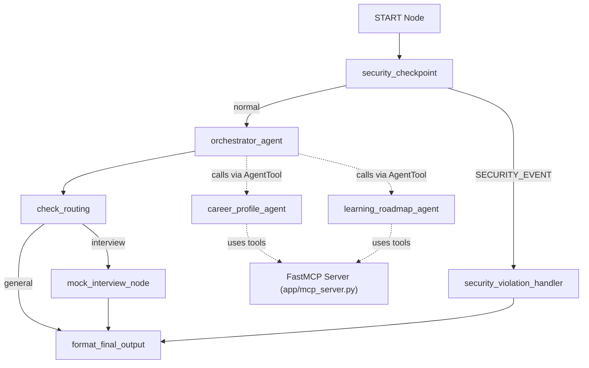

# CareerForge AI — Intelligent Multi-Agent Placement Coach

CareerForge AI is an intelligent placement preparation platform built with Google ADK and Gemini. It helps students assess technical skills, check company eligibility, optimize profiles, and practice live mock interviews.

---

## Prerequisites

- **Python 3.11+**
- **uv** (Python package manager)
- **Node.js 18+** (Required for ADK skill-set downloads)
- **Gemini API Key** (Get one at [ai.google.com/apikey](https://aistudio.google.com/apikey))

---

## Quick Start

```bash
# Clone the repository
git clone <repo-url>
cd careerforge-ai

# Configure environment variables
cp .env.example .env   # open .env and add your GOOGLE_API_KEY

# Install dependencies and sync packages
make install

# Start the interactive Dev Playground UI
make playground
```
This will open the local development interface at [http://localhost:18081](http://localhost:18081).

---

## Architecture Diagram



---

## Submission Write-Up & System Design

### 1. Problem Statement
Securing a career placement is a multi-dimensional challenge for students. It requires aligning resumes with ATS criteria, identifying and filling critical skill gaps, mapping out structured study plans (DSA, SQL, CS core), and practicing live mock interviews with constructive feedback. CareerForge AI provides a centralized, secure, multi-agent platform that automates these tasks dynamically while protecting privacy and ensuring academic integrity.

### 2. Architecture & Tech Stack
Built using the **Google ADK (Agent Development Kit)** and **FastAPI**, the application orchestrates multiple LLM-based specialized agents through an event-driven workflow graph.

- **ADK 2.0 Workflow Graph**: Defined in `app/agent.py`, the graph guides the user input sequentially through validation, orchestration, and routing.
- **Orchestrator Agent**: Intercepts user requests, routes general inquiries directly, and delegates complex duties to sub-agents via `AgentTool`.
- **Career Profile Agent**: Evaluates ATS scores, extracts skills, and calculates placement eligibility for companies like Amazon and TCS.
- **Learning Roadmap Agent**: Creates structured study timetables and milestone checklists based on target roles.
- **Mock Interview Node**: A stateful node using `RequestInput` to execute multi-turn interactive mock interviews, pausing to wait for student answers and evaluating the complete transcript at the end.
- **FastMCP Server**: Running locally at `app/mcp_server.py`, this server exposes custom tools to read and write student profiles, fetch curriculum resources, and append interview logs.

### 3. Security Design
- **PII Scrubbing**: Cleans email addresses and phone numbers from user input to maintain anonymity.
- **Prompt Injection Defense**: Rejects attempts to bypass instructions via the `SECURITY_EVENT` route.
- **Domain-Specific Rule (Academic Integrity)**: Detects keywords like "cheat in test" or "leak exam" to prevent cheating.
- **Structured JSON Audit Logs**: Automatically prints metadata logs for security monitoring.

### 4. Human-In-The-Loop (HITL) Flow
To simulate a real interview, the system utilizes ADK's `RequestInput` to pause graph execution and prompt the user for input. This allows the agent to conduct a realistic, multi-turn mock interview, evaluating the user's combined answers at the end of the session.

---

## How to Run

- **Interactive Playground (Recommended)**
  - Windows (PowerShell):
    ```powershell
    uv run adk web app --host 127.0.0.1 --port 18081 --reload_agents
    ```
  - macOS/Linux:
    ```bash
    make playground
    ```
- **Local API Web Server (FastAPI)**
  ```bash
  make run
  ```

---

## Sample Test Cases

### 1. General Greeting
- **Input:** `"Hi! I am new here. How can CareerForge AI help me?"`
- **Expected Route:** `START` ➔ `security_checkpoint` ➔ `orchestrator_agent` ➔ `check_routing` ➔ `format_final_output`.
- **Expected Behavior:** The Orchestrator replies directly outlining features (Profile review, Roadmaps, Mock Interviews) without calling tools.

### 2. Profile Scoring & Eligibility Check
- **Input:** `"Check my eligibility. My CGPA is 8.2 and I know Python and SQL. Can I apply to Amazon and TCS?"`
- **Expected Route:** `START` ➔ `security_checkpoint` ➔ `orchestrator_agent` (calls `career_profile_agent` via `AgentTool` which queries the local MCP server) ➔ `check_routing` ➔ `format_final_output`.
- **Expected Behavior:** Returns an ATS score, missing skills list, and eligibility status (e.g., eligible for TCS, needs DSA/System Design for Amazon).

### 3. Interactive Mock Interview
- **Input:** `"I want to practice my interview for a Software Engineer position."`
- **Expected Route:** `START` ➔ `security_checkpoint` ➔ `orchestrator_agent` (calls `start_mock_interview`) ➔ `check_routing` ➔ `mock_interview_node` (yields `RequestInput` and pauses).
- **Expected Behavior:** Initiates the session and prompts: *"Welcome to your Software Engineer mock interview! Question 1: Tell me about yourself..."*

---

## Demo Script / Presentation Guide

This script can be used for a 3-minute video presentation of the agent:

- **[0:00 — HOOK]**
  "Hi everyone! Preparing for placements can be incredibly stressful for students. From getting resume feedback to building study guides and practicing mock interviews, the process is highly fragmented. Today, I'm excited to show you CareerForge AI, a secure, multi-agent placement coach built on the Google ADK."
- **[0:20 — WHAT IT IS]**
  "CareerForge AI is an intelligent mentor that assesses technical skills, evaluates ATS compatibility, creates custom learning roadmaps, and conducts live, multi-turn mock interviews. It uses the Gemini API under the hood and operates completely locally, saving data securely."
- **[0:40 — ARCHITECTURE]**
  "Let's look at the system architecture. When a student enters a query, it first goes through our **Security Checkpoint** function node. This scrubs sensitive personal data and blocks prompt injection or academic cheating. Next, the **Orchestrator Agent** acts as the central coordinator. Using the ADK `AgentTool` pattern, the Orchestrator delegates tasks to specialized sub-agents: the **Career Profile Agent** and the **Learning Roadmap Agent**. Both sub-agents connect to a local **FastMCP Server** to manage persistent student profiles and fetch resources."
- **[1:30 — LIVE DEMO: ORCHESTRATION]**
  "Let's switch to the local Dev Playground at `http://localhost:18081`. We'll type: *'Check my eligibility. My CGPA is 8.2 and I know Python and SQL. Can I apply to Amazon?'* As you can see, the Orchestrator dynamically detects a profile query, invokes the Career Profile Agent, and renders a structured readiness report outlining missing skills and eligibility status."
- **[2:15 — LIVE DEMO: MOCK INTERVIEW]**
  "Now, let's start a mock interview by typing: *'Practice interview for Software Engineer'*. The Orchestrator routes us directly to our stateful **Mock Interview Node**. Notice how the workflow pauses using ADK's `RequestInput`, prompting us with the first question: *'Tell me about yourself'*. The graph yields, waits for our response, and moves to the next question. At the end, it calls Gemini to generate a complete feedback report with communication and technical readiness scores."
- **[3:00 — SECURITY & DATA PERSISTENCE]**
  "Behind the scenes, the Security Checkpoint keeps an audit log of every request. If a student tries to enter an email or phone number, it's redacted instantly. If they try to cheat, it redirects to the violation handler. All interview results are saved back to the student's log via FastMCP."
- **[3:30 — VALUE STATEMENT]**
  "By leveraging Google ADK's powerful graph-based workflows, specialized agents, and local MCP toolsets, CareerForge AI delivers a complete, secure, and privacy-preserving coach that gives every student a competitive edge in their career journey. Thank you!"

---

## Troubleshooting

1. **Error: `no agents found` or `Got unexpected extra arguments` (Windows)**
   - *Cause:* PowerShell wildcards expansion issues.
   - *Fix:* Run the server explicitly: `uv run adk web app --host 127.0.0.1 --port 18081 --reload_agents`
2. **Error: `404 model not found`**
   - *Cause:* Retired `gemini-1.5-*` models.
   - *Fix:* Set `GEMINI_MODEL=gemini-2.5-flash` (or `-lite`) in your `.env` file.
3. **Stale code edits in playground (Windows)**
   - *Cause:* Event loop lock prevents hot-reload.
   - *Fix:* Terminate port processes and relaunch:
     ```powershell
     Get-Process -Id (Get-NetTCPConnection -LocalPort 18081, 8090 -ErrorAction SilentlyContinue).OwningProcess | Stop-Process -Force
     ```

---

## Push to GitHub

1. Create a new repository at https://github.com/new (Name: `careerforge-ai`, Visibility: Public or Private, do NOT initialize with README).
2. Run the following commands in your project terminal:
   ```bash
   git init
   git add .
   git commit -m "Initial commit: careerforge-ai ADK agent"
   git branch -M main
   git remote add origin https://github.com/<your-username>/careerforge-ai.git
   git push -u origin main
   ```
3. Ensure `.gitignore` is active and contains:
   ```
   .env          # contains your API key — must NEVER be pushed
   .venv/
   __pycache__/
   *.pyc
   .adk/
   ```
   ⚠️ Never push `.env` to GitHub as it exposes your Gemini API key publicly.

---

## Assets

### 1. Cover Page / Thumbnail Banner


### 2. Workflow / Architecture Diagram

